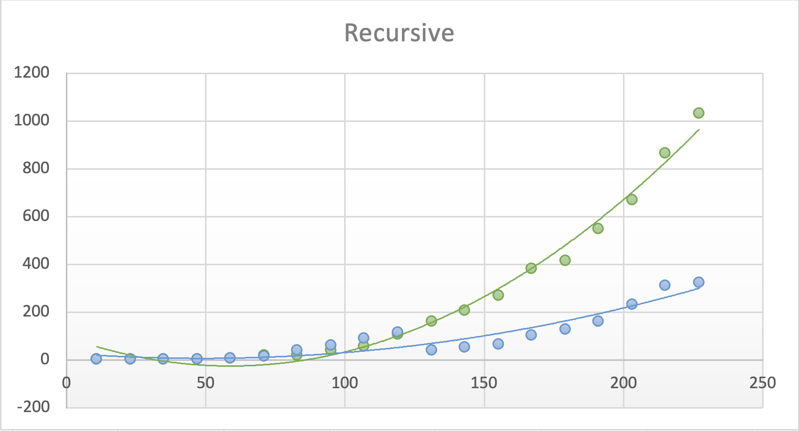
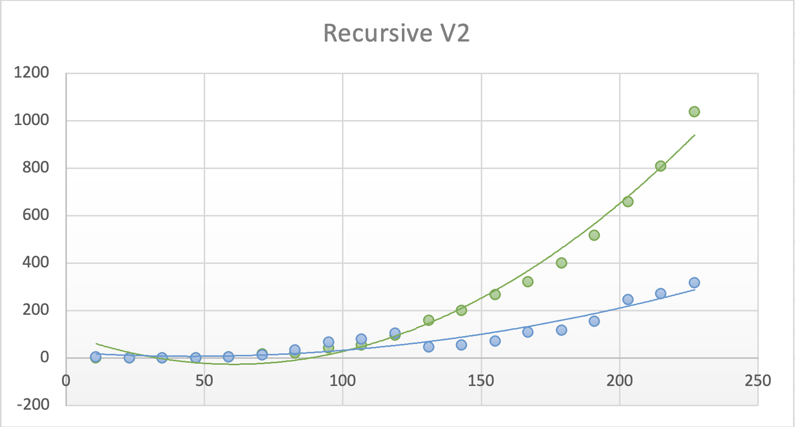
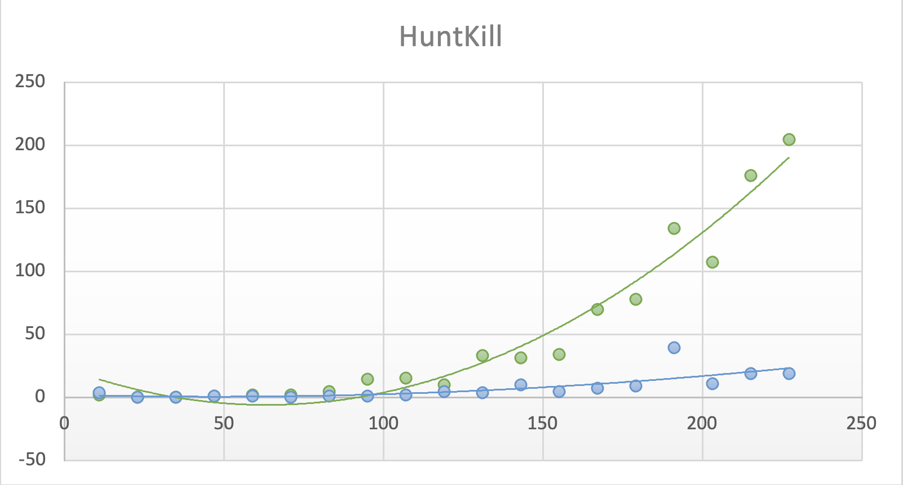

# Maze Game Performance Report - Yu Hua Yang 2133677

## Conditions & Specs

While working on the Best Performance setting, Visual Studio, Windows File Explorer and Git active in the background

Windows 10 Pro desktop, 8 Core 16 Thread CPU, 32GB RAM, 3060 ti GPU,

Tests are all done at a cap of 227x227 for if it went any further it would crash and for Hunt Kill it also stopped at 227 x 227 for there is not reason for the samnple size for all there reports to be different.

## Recursion V1 Report

* Map Size: 227 x 227
* Debug:  1030.288 ms
* Release: 321.5716 ms
* The Big(O) should have the complexity of O(n^2)

## Recursion V2 Report

* Map Size: 227 x 227
* Debug:  1037.3374 ms
* Release: 315.7035 ms
* The difference between V1 and V2 isn't substantional, but the release is roughly consistent staying under the V1 around anywhere from 5ms - 40ms. The Debug has also very difference though at the end V1 does beat out V2 it isnt always the case. This can be due to the small difference I could make to both code, because they were really similar and there wasn't much to change for the V1 was already really good.
* The Big(O) should have the complexity of O(n^2)

## Hunt Kill Report

* Map Size: 227 x 227
* Debug:  204.7858 ms
* Release: 18.5389 ms

## Conclusion

The reason I chose to improve recursion generation is because my hunt kill generation algorithm is really fast considering a 204ms debug and a 18ms release on initial test there for I did recursion. I shrunk and removed as much to improve and have it perform less actions. Though after testing my recursion code didn't change as much for my original code was also really good and didn't know what else to change. The difference is around a 20-30ms change tho there are certain outlier that are not within that average range.
So the two recursions seems relatively similar.